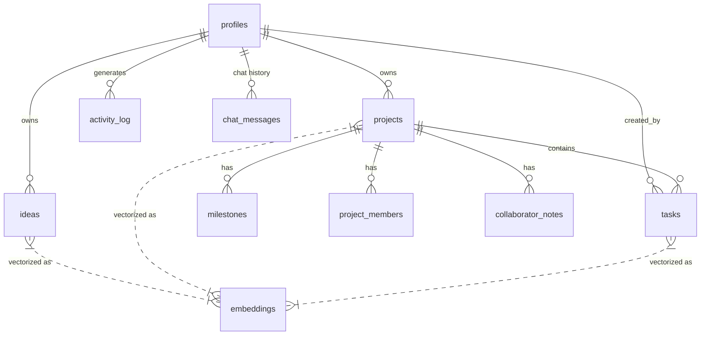

# FlowState - Creative Intelligence OS for Musicians
**Live URL:** https://flowstateos.netlify.app/
**Student:** [Your Name] | **Instructor:** Dr. Lee | **Course:** NLP Spring 2026 | **Date:** February 11, 2026

## 1. Application Description
FlowState is a **Creative Intelligence OS** designed for musicians and producers. It helps users capture ideas (text, voice, image, video, PDF), manage music projects, track tasks, and overcome creative blocks. FlowState uses **pgvector** for semantic search and **Gemini 2.5 Flash** as its LLM to power a RAG chatbot that understands the *content* of a user's workspace. Users can converse via voice (Vapi.ai) or text to retrieve context, create items, and get AI-generated answers grounded in their own data. Uploaded files are automatically analyzed by **Gemini 2.0 Flash** multimodal AI to extract transcripts, summaries, and key concepts — making every attachment searchable knowledge.

## 2. Test Credentials
| Role | Email | Password |
|------|-------|----------|
| **Admin** | `admin@test.com` | `password123` |
| **Regular User** | `member@test.com` | `password123` |

## 3. Requirements Mapping & Testing Guide
| Req | Where It Lives | How to Test |
| :--- | :--- | :--- |
| **1. Auth & Roles** | Supabase Auth. Routes: `/auth/sign-up`, `/auth/sign-in`. `is_admin` boolean in `profiles` table. `AuthProtectedRoute` guards `/dashboard`. `DashboardLayout` conditionally renders Admin sidebar section. | Log in as admin → see "Admin" section in sidebar with User Management page. Log in as regular user → admin section hidden. Refresh page → session persists. Log out → redirected. |
| **2. Profile** | Settings page at `/dashboard/settings`. Fields: display name, bio, avatar URL, timezone. `react-hook-form` + `zod` validation. Saved to `profiles` table. | Log in → sidebar "Settings" → edit display name, bio, avatar URL → click Save → see success toast → refresh page → verify changes persisted. |
| **3. Database** | Supabase PostgreSQL. 10 tables (see schema below). RLS enabled on all. pgvector extension active. `embeddings` table with `vector(768)` column. FK relationships throughout. | Create a project, idea, and task → data appears in dashboard. Schema diagram below shows all 10 tables + relationships. |
| **4. UI Components** | 6 ReactBits components on the landing page (see list below). shadcn/ui throughout the dashboard (Dialog, Sheet, Accordion, Badge, Button, Input, Textarea). | Visit landing page (`/`) → observe animated gradient headings, blur-in hero text, spotlight hover cards, animated stat counters, glare-hover benefit cards, star-border CTA button. |
| **5. Edge Functions** | 7 Supabase Edge Functions deployed (see Section 4 below). Triggered by: creating ideas/tasks (embedding), chatbot queries (ask-flowstate), voice commands (vapi-actions), file uploads (extract-idea-memory). | Open "Ask FlowState" panel → type a question → response comes from `ask-flowstate` Edge Function. Create an idea with a file upload → `extract-idea-memory` runs automatically. |
| **6. MCP Integration** | 3 MCP servers used during development (see Section 6 below). Configured in `.mcp.json`. | Evidence visible in the app: Supabase MCP managed all DB migrations and Edge Function deployments. ReactBits MCP generated the animated components. 21st.dev Magic MCP generated UI component code. |
| **7. RAG Chatbot** | `AskFlowState.tsx` panel. Embedding: Gemini Embedding-001 (768d). Vector search: `search_embeddings` RPC (cosine similarity). LLM: Gemini 2.5 Flash. History: `chat_messages` table. Knowledge base: all user ideas, tasks, and projects + extracted file memory. | Open "Ask FlowState" → ask example questions below → verify answers reference your actual workspace data with citations. Ask something unrelated → AI says it has no info. |

## 4. Supabase Edge Functions (7 Deployed)
| Function | Version | What It Does | Trigger |
|----------|---------|-------------|---------|
| `ask-flowstate` | v23 | RAG pipeline: embeds query → pgvector search → enriches context with memory → Gemini 2.5 Flash generates answer | Chatbot text/voice query |
| `vapi-actions` | v9 | Handles Vapi.ai voice tool calls: `create_task`, `create_idea`, `create_project`, `query_workspace` | Voice assistant commands |
| `extract-idea-memory` | v6 | Downloads uploaded file → Gemini 2.0 Flash multimodal → extracts transcript/summary/concepts → stores as JSONB | File upload on idea |
| `generate-embedding` | v4 | Generates 768d vector embedding via Gemini Embedding-001 for any entity | Creating/updating ideas, tasks, projects |
| `semantic-search` | v3 | Cosine similarity search via `search_embeddings` RPC | Cmd+K search |
| `parse-task-nl` | v3 | Parses natural language into structured task JSON (title, due date, priority) | Natural language task input |
| `regenerate-embeddings` | v1 | Batch re-embeds all entities for a user (model migration utility) | Manual admin trigger |

## 5. ReactBits Components (6 Used)
| Component | Library | Where It Appears |
|-----------|---------|-----------------|
| `GradientText` | ReactBits | Landing page: section headings in Benefits, Social Proof, Pricing, How It Works |
| `BlurText` | ReactBits | Landing page: Hero section main headline ("Capture Ideas. Organize Feedback. Finish Tracks.") |
| `SpotlightCard` | ReactBits | Landing page: Social Proof section testimonial cards (spotlight hover effect) |
| `CountUp` | ReactBits | Landing page: Social Proof section animated statistics (2,000+ creators, 50K sessions, etc.) |
| `GlareHover` | ReactBits | Landing page: Benefits section cards (glare/shine effect on hover) |
| `StarBorder` | ReactBits | Landing page: Final CTA section "Start Free Trial" button (animated star border) |

## 6. MCP Servers (3 Integrated)
| MCP Server | Purpose | Evidence in App |
|------------|---------|----------------|
| **Supabase MCP** | Database schema management, migrations, Edge Function deployment, SQL queries | All 10 tables, RLS policies, 7 Edge Functions deployed via MCP |
| **21st.dev Magic MCP** | AI-powered UI component generation and design | Dashboard component layouts and styling |
| **ReactBits MCP** | Animated component library integration | 6 ReactBits components listed above |

## 7. Database Schema (10 Tables, RLS on All)
`profiles` · `projects` · `ideas` · `tasks` · `milestones` · `project_members` · `collaborator_notes` · `activity_log` · `embeddings` (pgvector) · `chat_messages`

## 8. RAG Chatbot Validation Guide (Requirement 7)
The `admin@test.com` account has been **pre-seeded** with the following "Neon Nights" dataset so you can test immediately.

### Step 1: Verify Pre-Seeded Data
1.  **Project:** `Neon Nights EP` (Synthwave)
2.  **Idea:** `Bassline Concept` ("Rolling 8th-note bassline...")
3.  **Task:** `Mix the opening track` (Priority: High)
4.  **Placeholder Idea:** `Synth Reference` (Ready for you to upload a file to test multimodal RAG)

*(If you prefer to test creation capabilities, you can delete these or create new ones using the Voice Assistant).*

### Step 2: Test the Chatbot (Text & Voice)
Open the **Ask FlowState** panel (bottom right) and try these specific queries against the seeded data:

| Query Type | Input (Text or Voice) | Expected AI Response |
| :--- | :--- | :--- |
| **Semantic Search** | *"What was my idea about the bassline?"* | AI should retrieve the "Bassline Concept" idea and mention "rolling 8th-notes" and "sidechain compression". |
| **Project Context** | *"What is the genre of Neon Nights?"* | AI should find the project and answer "Synthwave". |
| **Complex Reasoning** | *"Draft a schedule to finish my high priority tasks."* | AI should find the "Mix the opening track" task and suggest a timeline. |
| **Voice Command** | *(Tap Mic)* *"Create a new task called Master the final track."* | AI should confirm task creation. Verify it appears in the Tasks board. |

